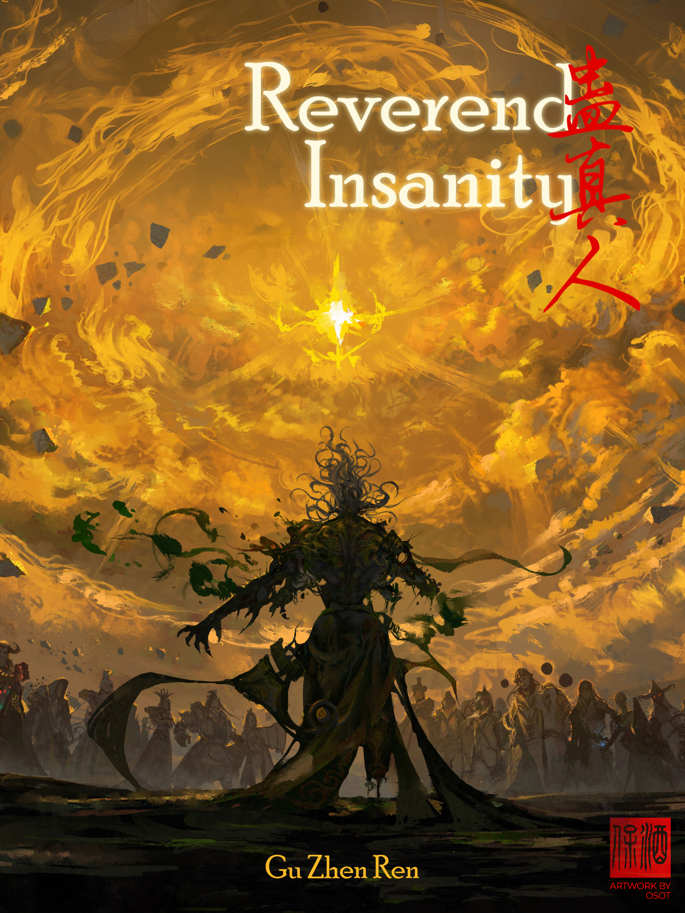

# Reverend Insanity by Gu Zhen Ren 蛊真人

<div align="center">
  
</div>

<br/>

> *Humans are the spirit of all living beings; Gu are the true essence of Heaven and Earth.*
> 
> *With **Three Fundamental Views*** turned deviant, the demon is reborn.*
> 
> *A dream of former days returns to life; an identical name is made anew.*
> 
> *The tale of a traveler who defies the cycle of fate.*
> 
> *A world where one raises, refines, and wields the primordial power of Gu.*
> 
> *The Spring Autumn Cicada, the Moonlight Gu, the Liquor Worm, the One-Stretch Golden Light Worm, the Gu of Hope...*
> 
> *Behold a peerless demon, walking the world as his heart desires.*

### Synopsis

Five centuries of wandering have distilled a singular clarity within Fang Yuan: in a world where the heavens treat all things as indifferent, morality is but a comforting shadow.

To the righteous, he is a plague; to the wicked, a nightmare. Yet when the world finally conspires to end him, he does not seek redemption. He gambles his existence on the Spring Autumn Cicada—a legendary Gu refined through five hundred years of sacrifice—and shatters the cycle of time.

Awakening in the body of his youth, armed with forbidden wisdom and a heart forged in the crucible of time, Fang Yuan begins his journey anew. He does not return to right his wrongs or seek vengeance against fate. Instead, he navigates a world of ruthless survival and celestial schemes to reach a destination only he can see, walking a path where the only law is his own will.

---

**Footnotes & Credits:**
* ***Three Fundamental Views (三观):** A Chinese philosophical concept referring to one's world view, values of worth, and philosophy on life. To have "unrighteous" views is to exist entirely outside conventional societal morality.
* **Gu (蛊):** Legendary, mystical creatures of the world. They are the true essence of power, appearing in countless forms—insects, worms, or even abstract energies—and are refined by cultivators to perform miraculous or terrifying feats.
* **Source:** Qidian Webnovel
* **Cover Artwork:** OSOT 酒保

---

## Archive Overview

This repository serves as a private library of the *Reverend Insanity* webnovel chapters. The content is stored in XHTML format to facilitate rapid retrieval and high-accuracy search for AI-driven lore analysis and reading.

The novel is organized by volumes, following the official structural progression of Fang Yuan's journey:

| Volume | Title | Chapters |
| :--- | :--- | :--- |
| **1** | A Demon's Nature Doesn't Change | 0 – 199 |
| **2** | The Demon Leaves the Mountain | 200 – 405 |
| **3** | The Demon Wreaks Chaos in the World | 406 – 649 |
| **4** | The Demon Lord Rampages Unhindered | 650 – 1021 |
| **5** | Demon King's Domination | 1022 – 1966 |
| **6** | Demon Venerable’s Eternal Life | 1967 – 2334 |

## External References & Wiki
For detailed information regarding Gu worms, cultivation ranks, and character histories, refer to the official community-maintained wiki:

* **[Reverend Insanity Fandom Wiki](https://reverend-insanity.fandom.com/wiki/Reverend_Insanity_Wiki)**
    * [Characters](https://reverend-insanity.fandom.com/wiki/Category:Character)

---

## How to Build the EPUB

<details>
  <summary>Do not manually zip the folder and rename it to `.epub`; this breaks required file compression rules and will corrupt the book. Use the included build script instead.
</summary>
  <br>
  Or just download "notes" and rename it to a .epub
</details>

**Prerequisite:** [Python 3](https://www.python.org/downloads/)

1. **Download:** Clone this repository or download and fully extract the ZIP.
2. **Navigate:** Open your terminal or command prompt and `cd` into the extracted folder.
   * **Windows:**
     ```bash
     cd C:\Users\Username\Downloads\Reverend-Insanity-main
     ```
   * **macOS / Linux:**
     ```bash
     cd ~/Downloads/Reverend-Insanity-main
     ```
3. **Run:** Execute the build script to generate the book.
   * **Windows:**
     ```bash
     python make_epub.py
     ```
   * **macOS / Linux:**
     ```bash
     python3 make_epub.py
     ```
---

## Legal Disclaimer
This repository is for personal archival and educational use only. I do not own any assets, characters, or story content associated with *Reverend Insanity*; all rights belong to the author, **Gu Zhen Ren (蛊真人)**, and the original publishers (**Qidian**).

## Support the Author
If you enjoyed this work, please consider supporting the creator through these official channels to ensure the benefits reach him directly:

* **Qidian:** Purchase VIP chapters or provide "Monthly Tickets" for his current active projects.
* **Official Social Media:** Follow and interact with Gu Zhen Ren on **Douyin** (Chinese TikTok) to donate or engage directly.
* **Official eBook Releases:** Purchase licensed versions (e.g., via **Amazon**) as these have different royalty structures than web platforms.
